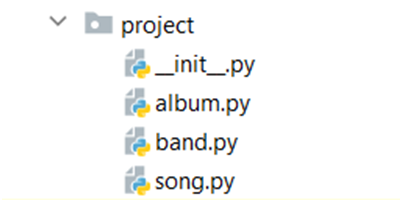

Problem Description

                       7.	Spoopify

You are tasked to create three classes: a Song class, an Album class, and a Band class.
 
The Song class should receive a name (string), a length (float), and a single (bool) upon initialization. 
It has one method:
-	get_info()
o	Returns the information of the song in this format: "{song_name} - {song_length}"

The Album class should receive a name (string) upon initialization and might receive one or more songs. 
It also has instance attributes: published (False by default) and songs (an empty list). It has four methods:
-	add_song(song: Song)
o	Adds the song to the album and returns "Song {song_name} has been added to the album {name}."
o	If the song is single, returns "Cannot add {song_name}. It's a single"
o	If the album is published, returns "Cannot add songs. Album is published."
o	If the song is already added, return "Song is already in the album."
-	remove_song(song_name: str)
o	Removes the song with the given name and returns "Removed song {song_name} from album {album_name}."
o	If the song is not in the album, returns "Song is not in the album."
o	If the album is published, returns "Cannot remove songs. Album is published."

-	publish()
o	Publishes the album (set to True) and returns "Album {name} has been published."
o	If the album is published, returns "Album {name} is already published."
-	details()
o	Returns the information of the album, with the songs in it, in the format: 
"Album {name}
 == {first_song_info}
 == {second_song_info}
 …
 == {n_song_info}"

The Band class should receive a name (string) upon initialization. It also has an attribute albums (an empty list). 
The class has three methods:
-	add_album(album: Album)
o	Adds an album to the collection and returns "Band {band_name} has added their newest album {album_name}."
o	If the album is already added, returns "Band {band_name} already has {album_name} in their library."
-	remove_album(album_name: str)
o	Removes the album from the collection and returns "Album {name} has been removed."
o	If the album is published, returns "Album has been published. It cannot be removed."
o	If the album is not in the collection, returns "Album {name} is not found."
-	details()
o	Returns the information of the band, with their albums, in this format: 
"Band {name}
 {album details}
 ...
 {album details}"

_______________________________________________
Example

Test Code	(no input data in this task)

song = Song("Running in the 90s", 3.45, False)

print(song.get_info())

album = Album("Initial D", song)

second_song = Song("Around the World", 2.34, False)

print(album.add_song(second_song))

print(album.details())

print(album.publish())

band = Band("Manuel")

print(band.add_album(album))

print(band.remove_album("Initial D"))

print(band.details())

_______________________________________________

Output

Running in the 90s - 3.45

Song Around the World has been added to the album Initial D.

Album Initial D

== Running in the 90s - 3.45

== Around the World - 2.34

Album Initial D has been published.

Band Manuel has added their newest album Initial D.

Album has been published. It cannot be removed.

Band Manuel

Album Initial D

== Running in the 90s - 3.45

== Around the World - 2.34

_______________________________________________
