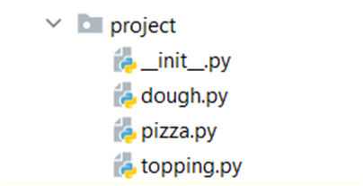

Problem description

                      2.	Pizza Maker
Create a separate file for each class as shown below and submit a zip file containing all files 
(zip the whole project folder/module) - it is important to include all files in the project module 
to make proper imports.

!

Create a class called Topping. Upon initialization, it should receive:
•	topping_type: str - if the topping is an empty string, raise a ValueError with the message 
"The topping type cannot be an empty string"
•	weight: float - if the weight is 0 or less, raise a ValueError with the message 
"The weight cannot be less or equal to zero"
Hint: Use Getters and Setters.

Create a class called Dough. Upon initialization, it should receive:
•	flour_type: str - if the flour type is an empty string, raise a ValueError with the message "
The flour type cannot be an empty string"
•	baking_technique: str - if the technique is an empty string, raise a ValueError with the message
"The baking technique cannot be an empty string"
•	weight: float - if the weight is 0 or less, raise a ValueError with the message "The weight 
cannot be less or equal to zero"

Create a class called Pizza. Upon initialization, it should receive:
•	name: str - if the name is an empty string, raise a ValueError with the message "The name
cannot be an empty string"
•	dough: Dough - if the dough is None, raise a ValueError with the message "You should add 
dough to the pizza"
•	max_number_of_toppings: int – represents the maximum number of toppings the pizza should have. 
If the capacity is 0 or less, raise a ValueError with the message "The maximum number of toppings cannot be less or equal to zero"
•	toppings: dict – empty dictionary upon initialization that will contain the topping type as 
a key and the topping's weight as a value.
The class should also have 2 instance methods:
•	add_topping(topping: Topping) 
o	Add a new topping to the dictionary
o	If there is no space left for a new topping, raise a ValueError: "Not enough space for another topping"
o	If the topping is already in the dictionary, increase the value of its weight.
•	calculate_total_weight() - returns the total weight of the pizza (dough's weight and toppings' weight)

_______________________________________________
Example

Test Code	(no input data in this task)

tomato_topping = Topping("Tomato", 60)

print(tomato_topping.topping_type)

print(tomato_topping.weight)

mushrooms_topping = Topping("Mushroom", 75)

print(mushrooms_topping.topping_type)

print(mushrooms_topping.weight)

mozzarella_topping = Topping("Mozzarella", 80)

print(mozzarella_topping.topping_type)

print(mozzarella_topping.weight)

cheddar_topping = Topping("Cheddar", 150)

pepperoni_topping = Topping("Pepperoni", 120)

white_flour_dough = Dough("White Flour", "Mixing", 200)

print(white_flour_dough.flour_type)

print(white_flour_dough.weight)

print(white_flour_dough.baking_technique)

whole_wheat_dough = Dough("Whole Wheat Flour", "Mixing", 200)

print(whole_wheat_dough.weight)

print(whole_wheat_dough.flour_type)

print(whole_wheat_dough.baking_technique)

p = Pizza("Margherita", whole_wheat_dough, 2)

p.add_topping(tomato_topping)

print(p.calculate_total_weight())

p.add_topping(mozzarella_topping)

print(p.calculate_total_weight())

p.add_topping(mozzarella_topping)

_______________________________________________
Output

Tomato

60

Mushroom

75

Mozzarella

80

White Flour

200

Mixing

200

Whole Wheat Flour

Mixing

_______________________________________________